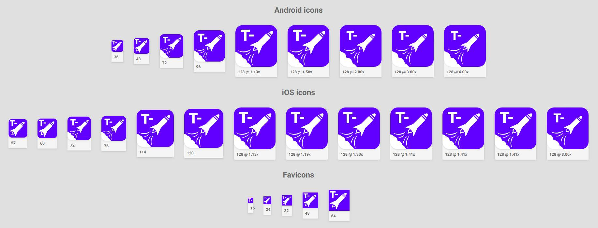

[](https://travis-ci.com/eweilow/ikon)
[](https://www.npmjs.com/package/@eweilow/ikon-cli)
[](https://greenkeeper.io/)

# Ikon (**work in progress**)

Warning: this is a work in progress, so bugs might really occur. If you chose to use Ikon, please let me know if any issues arise.



A React-based icon generator for modern web apps - generates icons by screenshotting them with [Puppeteer](https://github.com/GoogleChrome/puppeteer).

## Why create icons with React?

React is used by many to create web applications, so it's natural to extend the same knowledge to icon creation.

The idea behind this is that the icon can be considered a normal component, which can be styled according to different dimensions.
In practical use one might want a different style of icon for smaller favicons (16px-64px sizes), while doing nice scaling for app icons and finally applying entirely different styles when generating launch screens (that may include text).

This just falls out natural when working with web technologies, which must be made responsive in order to properly work on all sorts of screens.

## How does it work?

The user of Ikon simply creates a TypeScript file in their project, which could look like this (while this example merely creates icons that write out dimensions and their pixel ratios, only imagination is the limit):

```tsx
import React from "react";
import { IconGenerationComponent } from "@eweilow/ikon-cli";

const Component: IconGenerationComponent = props => (
  <div
    style={{
      background: "white",
      color: "red",
      fontWeight: "bold",
      height: "100%",
      width: "100%"
    }}
  >
    {props.name}: {props.width}x{props.height}@{(props.pixelRatio * 100).toFixed(0)}%
  </div>
);

export default Component;
```

When running Ikon, a Chromium instance is started in the background using [Puppeteer](https://github.com/GoogleChrome/puppeteer).
The component provided is rendered using React to HTML, which is then screenshot using Puppeteer.
All icons are saved and several methods of accessing the icons are also saved - in HTML, TypeScript, JavaScript and JSON.

## How is it used?

First install Ikon and the components you want. For most users, this is simply:

```bash
yarn add @eweilow/ikon-cli
```

### Development

Assuming that a user has an _icon file_ `icon.ts` in their project root, icons can be developed using the development command

```bash
ikon dev --file icon.ts
```

This starts a development server on the default port `4001`, which hot reloads the component file when needed.

### Building icons

To build icons ready for production use, one can use the build command

```bash
ikon build --file icon.ts --outDir ./public/icons --generationDir ./generated
```

By default, this assumes that the web service using these icons provide them under the public URL `/icons`. This can be changed using the `--publicPath`-flag.

### Using the icons in an app

The simplest method in an app where you have control over the entire document in server-side rendering, either import the generated `icons.html` file into the `<head/>` of each page, or use the generated React components in `icons.tsx` or `icons.jsx`.
In a Next.js application, this would look something similar to

```jsx
import Document, { Html, Head, Main, NextScript } from "next/document";

import Icons from "../generated/icons";

class MyDocument extends Document {
  render() {
    return (
      <Html>
        <Head>
          <Icons />
        </Head>
        <body>
          <Main />
          <NextScript />
        </body>
      </Html>
    );
  }
}

export default MyDocument;
```
